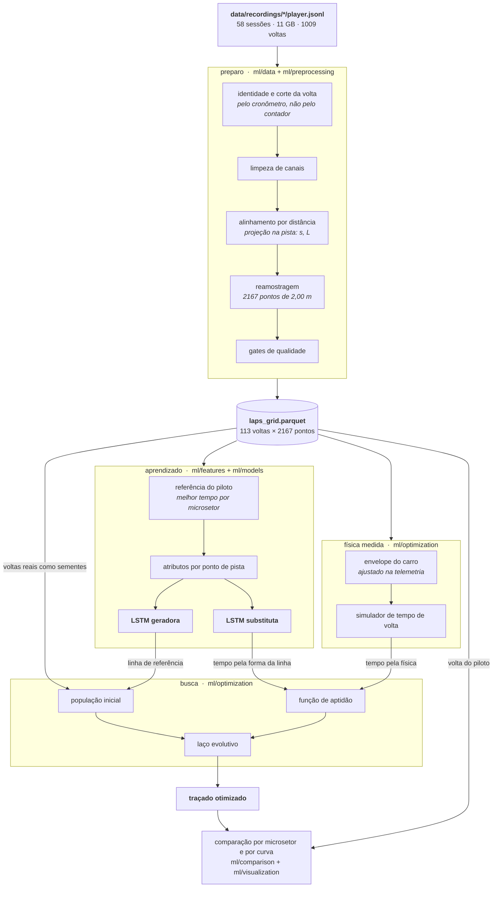
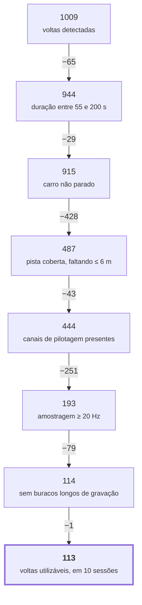
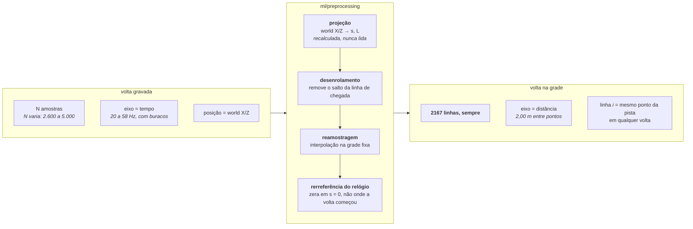
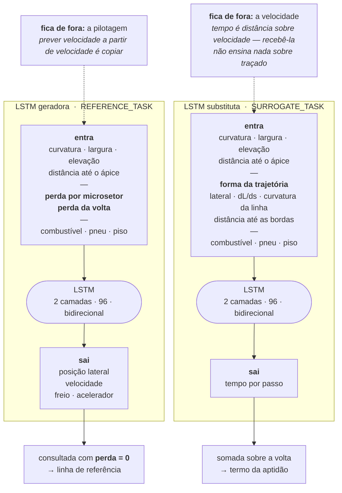
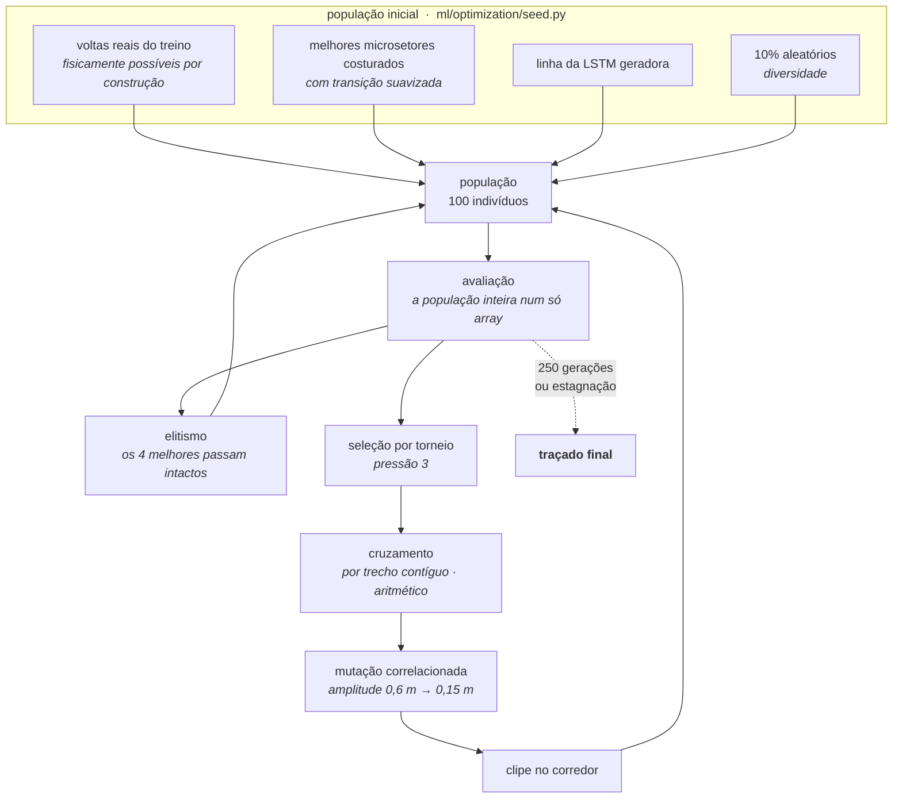
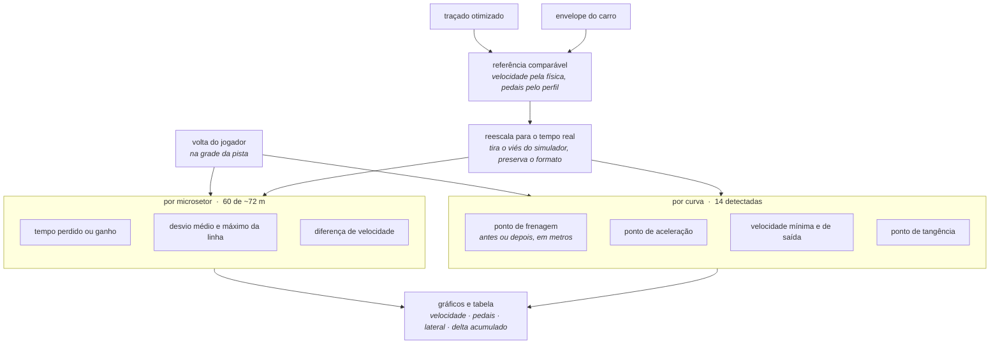
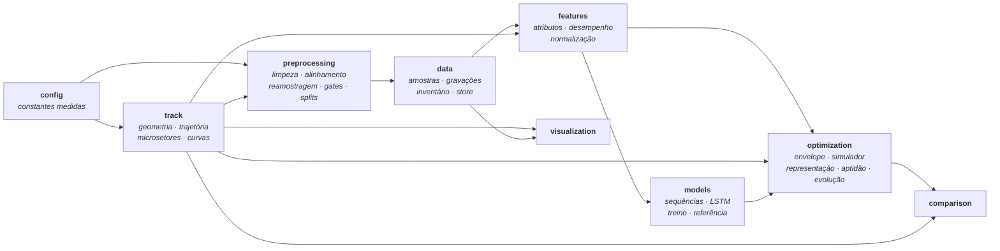

# Arquitetura do subsistema de aprendizado de traçado

Diagramas do sistema como ele ficou implementado em [`backend/ml/`](../backend/ml/),
não do desenho inicial — vários pontos mudaram durante a construção, e onde
mudaram o diagrama traz o motivo.

Todos os números são medidos no dataset real: 58 sessões de Interlagos,
11 GB, 1009 voltas brutas detectadas.

---

## Figura 1 — Arquitetura geral

O caminho completo, da gravação bruta ao feedback por curva.

**A leitura que importa:** as duas redes entram em lugares diferentes. A geradora
alimenta a *semente* da busca; a substituta alimenta o *julgamento*. Nenhuma das
duas decide sozinha — a física entra na aptidão ao lado da rede, porque uma rede
treinada nas voltas do piloto só sabe premiar o que já viu e nunca apontaria
nada melhor que a melhor volta dele.

---

## Figura 2 — Funil de qualidade

Quantas voltas sobrevivem a cada gate, aplicados em sequência.

**Por que cada corte existe:** cada gate em
[`preprocessing/quality.py`](../backend/ml/preprocessing/quality.py) tem, no
comentário, a volta concreta do dataset que passaria sem ele. Os dois maiores
cortes são os mais instrutivos.

- **Cobertura (−428).** Uma volta interrompida no meio da gravação tem tempo
  plausível e cobre meia pista. E mesmo perto do fim importa: 16 m sem gravação
  antes da linha viravam um microsetor de 0,719 s — 360 km/h numa reta onde o
  carro faz 271 — que entrava na referência do piloto como recorde.
- **Amostragem (−251).** As duas voltas "mais rápidas" do dataset, 82,698 s e
  83,469 s, foram gravadas a 7,6 Hz. São gravações truncadas reportando tempo
  menor, não recordes.

---

## Figura 3 — De amostra no tempo a ponto na pista

A transformação central do pré-processamento: o que entra é irregular no tempo,
o que sai é fixo no espaço.

**Por que isso é o que torna tudo possível:** duas voltas nunca têm o mesmo
número de amostras nem os mesmos instantes, então compará-las quadro a quadro
compara pontos diferentes da pista. Depois desta etapa, somar, subtrair e cruzar
voltas passa a ser aritmética de vetores do mesmo tamanho — e é isso que o
cruzamento do algoritmo evolutivo exige para significar alguma coisa.

Duas armadilhas que o diagrama resolve, e que custaram uma versão cada:

- **`distanceAlongTrack` gravado não serve.** Seis sessões o gravaram como
  `null`, e as que gravaram usaram versões diferentes da geometria. A projeção é
  refeita aqui e bate com o runtime dentro de 0,15 m no p95.
- **O relógio dava a volta no meio do vetor.** A volta começa em `s ≈ 3 m` e a
  grade em `s = 0`, então os primeiros pontos da grade são o *fim* da volta. Sem
  rerreferenciar, o tempo acumulado não é monotônico e o primeiro microsetor sai
  com 0,019 s.

---

## Figura 4 — As duas redes

O desenho central do sistema. O que **não** entra em cada rede é tão decisivo
quanto o que entra.

**O que o condicionamento faz:** a geradora recebe *quanto aquela volta perdeu*
para a melhor do piloto naquele microsetor. Sem esse atributo, o único jeito de
a rede acertar todas as voltas de uma vez é responder a média delas — que é
exatamente o que o enunciado proíbe. Com ele, pede-se a pilotagem
correspondente à perda zero: uma volta em que o piloto esteve no próprio
recorde em todos os trechos ao mesmo tempo, e que ele nunca deu.

**Que funcionou, medido:** pedindo perda 0,0 s a rede responde 199 km/h de
mediana; pedindo 0,5 s, responde 134 km/h, e a linha se desloca 3,4 m em média.
Se ela tivesse aprendido a média, as duas respostas seriam iguais.

---

## Figura 5 — Função de aptidão

Como o custo de um indivíduo é montado. Tudo em segundos, antes de somar.

```mermaid
flowchart TB
  IND["indivíduo<br/><i>361 valores de deslocamento lateral</i>"]
  DEC["decodificação<br/><i>spline periódica → 2167 pontos</i><br/><i>clipe no corredor da pista</i>"]
  IND --> DEC

  DEC --> T1["<b>simulador quase-estacionário</b><br/>limite de curva → frenagem → tração<br/>com elipse de atrito"]
  DEC --> T2["<b>LSTM substituta</b><br/>tempo que este piloto faz<br/>numa linha desta forma"]
  DEC --> P1["fora dos limites<br/><i>rede de segurança: 0 por construção</i>"]
  DEC --> P2["serpenteio acima do p95 real"]
  DEC --> P3["variação de curvatura acima do p95 real"]

  T1 --> MIX["<b>tempo combinado</b><br/>&#40;1 − α&#41; · física &nbsp;+&nbsp; α · rede<br/><i>α = 0,25</i>"]
  T2 --> MIX

  MIX --> COST["<b>custo</b> = tempo combinado + penalizações"]
  P1 --> COST
  P2 --> COST
  P3 --> COST
```

**Por que dois tempos.** A simulação física não sabe nada deste piloto: diz o
que o carro aguenta. A rede não sabe nada de trajetórias que ninguém dirigiu:
diz o que este piloto costuma extrair de uma linha com esta forma. Só a física
produz um traçado que ninguém consegue seguir; só a rede produz um traçado que
nunca supera a melhor volta já gravada.

**Por que as penalizações de forma são calibradas nas voltas reais.** "Volante
demais" não tem valor absoluto — depende da pista e do carro. Os limiares saem
do p95 das voltas gravadas: o que o piloto faz de verdade não é penalizado, o
que passa disso é.

---

## Figura 6 — Laço evolutivo

**Por que os operadores são estes.** O genoma é uma curva amostrada: genes
vizinhos descrevem metros vizinhos de pista e são fortemente correlacionados.
Isso muda o que funciona — cruzamento uniforme sorteia cada ponto de um pai
diferente e produz uma linha que oscila entre as duas, pior que ambas; herdar
trechos inteiros herda *decisões*. E a mutação é suavizada ao longo da pista
antes de ser somada, porque ruído branco em pontos de controle vizinhos é
exatamente a oscilação de alta frequência que o simulador pune: a mutação sairia
sempre pior e a busca pararia de explorar.

---

## Figura 7 — Comparação com o piloto

**Duas unidades porque as perguntas são de naturezas diferentes.** O microsetor
responde *onde* se perdeu tempo — corte regular, o mesmo que o painel de análise
assistida do aplicativo já usa. A curva responde *por quê* — ponto de frenagem,
tangência e velocidade de saída só existem em relação a uma curva.

Tudo é medido na grade da pista, então "freou 12 m depois" é uma diferença de
distância de verdade, e não uma diferença de índice de amostra entre duas voltas
que têm números de amostras diferentes.

---

## Figura 8 — Mapa dos módulos

Quem depende de quem. As setas apontam para a dependência.

O pacote não é importado pelo runtime do aplicativo em ponto nenhum: ele lê o
que o runtime grava, e escreve em `data/ml/`. É o que permite manter o PyTorch
fora do executável empacotado.

---

## Onde cada diagrama vive no código

| figura | módulos |
|---|---|
| 1 — arquitetura geral | todo o pacote |
| 2 — funil de qualidade | [`preprocessing/quality.py`](../backend/ml/preprocessing/quality.py) · [`data/inventory.py`](../backend/ml/data/inventory.py) |
| 3 — amostra → ponto de pista | [`preprocessing/alignment.py`](../backend/ml/preprocessing/alignment.py) · [`preprocessing/resampling.py`](../backend/ml/preprocessing/resampling.py) |
| 4 — as duas redes | [`models/sequences.py`](../backend/ml/models/sequences.py) · [`models/lstm.py`](../backend/ml/models/lstm.py) |
| 5 — aptidão | [`optimization/fitness.py`](../backend/ml/optimization/fitness.py) · [`optimization/lap_time_model.py`](../backend/ml/optimization/lap_time_model.py) |
| 6 — laço evolutivo | [`optimization/evolution.py`](../backend/ml/optimization/evolution.py) · [`optimization/operators.py`](../backend/ml/optimization/operators.py) · [`optimization/seed.py`](../backend/ml/optimization/seed.py) |
| 7 — comparação | [`comparison/`](../backend/ml/comparison/) · [`visualization/`](../backend/ml/visualization/) |
| 8 — mapa dos módulos | [`backend/ml/`](../backend/ml/) |

A formulação matemática das duas redes — equações da célula, bidirecionalidade,
contagem de parâmetros, perda e otimização — está em
[`lstm_matematica.md`](lstm_matematica.md). Os resultados medidos e as
limitações conhecidas estão em [`backend/ml/README.md`](../backend/ml/README.md).
