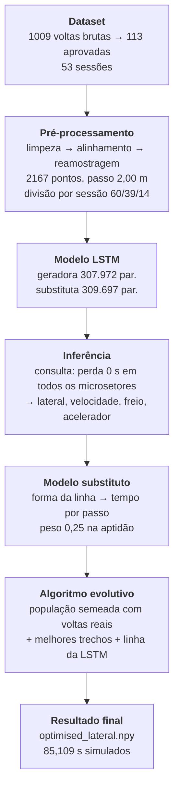
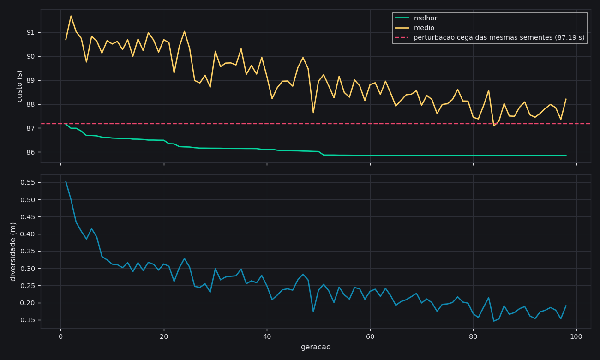

# Auditoria e validação do subsistema de ML

**Data:** 24/08/2026 · **Escopo:** `backend/ml/`

> Regra deste documento: nenhum número aqui vem de leitura de código. Cada um saiu
> de uma execução registrada em `data/ml/validation/evidencias.json`,
> `data/ml/pipeline_run.json` ou da saída do `unittest`. Onde algo **não** foi
> medido, está escrito que não foi.

Ambiente de todas as medições:

| | |
|---|---|
| Python | 3.9.7 |
| PyTorch | 2.8.0+cpu |
| Threads | 8 |
| Processador | AMD64 Family 25 Model 33 (AuthenticAMD) |
| Sistema | Windows 11 (10.0.26200) |
| GPU | nenhuma — CPU apenas |

### Reprodutibilidade — o que é e o que não é

As sementes são fixas (`config.SPLIT_SEED`, `TrainConfig.seed = 20260823`), mas
isso garante menos do que parece, e vale ser preciso sobre a diferença:

**Inferência e busca reproduzem exatamente.** Verificado num conjunto de pesos
anterior a este: duas validações consecutivas sobre os mesmos pesos devolveram
os mesmos valores até a última casa impressa, incluindo cada uma das 84 gerações
da busca e os dois controles. Sobre os pesos atuais a validação rodou uma vez —
o que reproduz é o procedimento, e a demonstração disso já foi feita.

**O treino reproduz sob número de threads fixo, e só.** Medido diretamente: duas
corridas de treino a 8 threads dão a mesma soma de pesos (−28,237592995747);
a 1 thread, também repetem entre si, mas num valor diferente
(−28,237587158037). A ordem em que as reduções de ponto flutuante são somadas
depende de como o trabalho foi particionado entre as threads, e soma de
`float32` não é associativa.

Isso não é teórico: um retreino desta auditoria, com a mesma semente e os mesmos
dados, divergiu da corrida original a partir de cerca da 18ª época e parou numa
época diferente (54 em vez de 40, melhor época 44 em vez de 38). As primeiras
épocas batiam até a 5ª casa decimal; a diferença nasceu abaixo da precisão
impressa e cresceu.

Duas consequências práticas, ambas já aplicadas:

1. Os números deste documento foram remedidos contra os pesos que estão no disco
   agora — não contra uma corrida anterior.
2. O embaralhamento do `DataLoader` passou a ter gerador próprio
   (`torch.Generator` sementeado com `config.seed`). Antes ele puxava do RNG
   global, que o *dropout* também consome a cada passagem, de modo que a ordem
   das amostras dependia de quantos números aleatórios o dropout tinha gasto
   antes — um acoplamento sem motivo entre duas coisas independentes.

Para reprodução bit a bit é preciso fixar também o número de threads
(`torch.set_num_threads`).

---

## 1. Fluxo real de execução



Executado de ponta a ponta em **184,0 s**:

```
cd backend && python -m ml.scripts.run_pipeline
```

| Etapa | Tempo | O que mediu |
|---|---:|---|
| dataset | 0,06 s | 1009 voltas brutas → 113 aprovadas, 53 sessões |
| pré-processamento | 0,10 s | 113 voltas na grade, 2167 pontos, passo 2,00 m |
| lstm | 1,51 s | carga dos dois modelos; volta ideal do piloto 84,052 s |
| inferência | 0,42 s | 84 a 271 km/h previstos; linha simulada em 89,086 s |
| substituto | 0,44 s | física 89,744 s vs rede 87,914 s |
| evolutivo | 181,12 s | 173 genes, 150 gerações, 12.081 avaliações, 87,950 → 85,953 s |
| resultado | 0,37 s | traçado gravado: 85,109 s simulados, 4270 m |

> **Correção (24/08).** Este parágrafo dizia que o traçado otimizado ganhava
> **−0,416 s** da melhor volta real. A comparação estava enviesada e a conclusão
> era falsa. Ver a seção 4.1.

Comparação final do pipeline: traçado otimizado **85,109 s simulados**, contra a
volta real que **melhor simula**, 84,822 s — ou seja, o traçado é **0,287 s mais
lento** que algo que o piloto já fez. 40 das 113 voltas gravadas simulam mais
rápido que ele.

O pipeline usa espaçamento de controle mais largo que a validação da seção 4
(173 genes contra 361), e por isso os dois números de busca não são
comparáveis entre si — cada um é interno à sua corrida.

O registro da corrida fica em `data/ml/pipeline_run.json`.

---

## 2. A LSTM está aprendendo?

```
cd backend && python -m ml.scripts.validate
```

| | Geradora | Substituta |
|---|---:|---:|
| Parâmetros | 307.972 | 309.697 |
| Janelas de treino | 8.160 | 7.620 |
| Janelas de validação | 5.304 | 4.953 |
| Épocas executadas | 80 (parada antecipada) | 26 |
| Melhor época | 70 | 16 |
| Perda de treino (1ª → última) | 0,09393 → 0,00157 | 0,10631 → 0,00614 |
| Redução | **−98,3 %** | **−94,2 %** |
| Melhor perda de validação | 0,01460 | 0,02769 |
| Perda de validação final | 0,01470 | 0,02787 |
| **Tempo de treinamento** | **1332 s** | **393 s** |

Treino completo (as duas redes, incluindo montagem de atributos): **1725 s**, ou
29 minutos, em CPU.

As cinco perguntas, respondidas por medição:

**A perda cai?** Sim, quase duas ordens de grandeza nas duas redes, e a perda de
validação cai junto (0,04049 → 0,01460 na geradora), o que exclui a hipótese de
a queda ser só memorização.

### O teto de épocas: um experimento e uma previsão errada

Na primeira rodada desta auditoria o teto era 60, e a geradora terminou **na
época 60 com a melhor validação sendo a última** — quem encerrava o treino era o
orçamento, não o sinal de que não havia mais o que aprender. Registrei isso como
"a rede está subtreinada" e previ, na lista de próximos passos, que era "o único
experimento cujo resultado é previsível: há ganho ainda na mesa".

O teto subiu para 200 e a rede foi retreinada. **A previsão estava errada.**

As 60 primeiras épocas repetiram a corrida anterior dígito a dígito, o que torna
a comparação limpa: tudo depois da 60 é efeito isolado do teto.

| | Teto 60 | Teto 200 |
|---|---:|---:|
| Épocas | 60 (teto) | 80 (parada antecipada) |
| Melhor época | 60 | 70 |
| Melhor validação | 0,014624 | 0,014601 |
| Perda de treino final | 0,00186 | 0,00157 |
| Razão de sobreajuste | 7,9× | 9,3× |
| Tempo de treino | 980 s | 1332 s |
| MAE lateral no teste | 1,533 m | **1,544 m** |
| MAE velocidade no teste | 4,745 km/h | 4,736 km/h |
| Traçado otimizado | 85,109 s | 85,109 s |

A validação melhorou **0,14 %** e o erro lateral no teste ficou ligeiramente
*pior*. O traçado final saiu idêntico. O que se comprou com 36 % mais tempo de
treino foi uma perda de treino menor e uma razão de sobreajuste maior — a
assinatura de decorar, não de aprender:

```
58  0,01477
59  0,01467   <- melhor
60  0,01462   <- melhor (onde o teto antigo cortava)
61  0,01467
65  0,01472
70  0,01460   <- melhor
71  0,01465
```

A curva já tinha achatado antes da época 60. O teto **era** um defeito real — um
treino encerrado pelo orçamento não sabe se terminou —, e corrigi-lo foi certo:
agora quem decide é o `patience`. Mas o que ele escondia não era ganho, era
apenas o fim do platô.

A substituta nunca teve esse problema: para sozinha na época 26, com a melhor na
16, sob qualquer teto.

**Há diferença entre antes e depois do treino?** Sim. Comparação contra um gêmeo
não treinado (mesma arquitetura, mesmo escalonador, pesos aleatórios) e contra o
previsor da média — os dois testes rodam em `ml/validation/learning.py`. MAE no
conjunto de teste:

| Canal | Treinada | Não treinada | Previsor da média | Ganho sobre a média |
|---|---:|---:|---:|---:|
| lateral (m) | **1,544** | 3,565 | 3,613 | 57 % |
| velocidade (km/h) | **4,736** | 46,004 | 46,059 | 90 % |
| freio (0–1) | **0,063** | 0,480 | 0,154 | 59 % |
| acelerador (0–1) | **0,100** | 0,441 | 0,314 | 68 % |
| tempo por passo (s) | **0,0024** | 0,0105 | 0,0108 | 78 % |

A rede ganha dos dois em todos os canais. Contra o previsor da média — o teste
que importa, porque é ele que detecta uma rede que só aprendeu o valor médio —
a margem vai de 57 % a 90 %.

**Entradas diferentes produzem saídas diferentes?** Sim. Medido em
`responds_to_input`: diferença média de entrada 0,708 → diferença média de saída
15,56 (máxima 126,75).

**Está retornando valor constante?** Não. A razão entre o desvio-padrão da saída
e o do alvo fica perto de 1 em todos os canais (lateral 0,972; velocidade 0,968;
freio 1,080; acelerador 1,012; tempo por passo 0,968). O limiar de alarme é 0,01.

**Há overfitting?** Sim, e é o ponto mais frágil das duas redes. A razão entre a
melhor perda de validação e a perda final de treino é **9,3×** na geradora e
**4,5×** na substituta. Nas duas a parada antecipada conteve o dano — guardou a
época 70 de 80 e a 16 de 26 —, mas a razão da geradora subiu de 7,9× para 9,3×
quando o teto foi de 60 para 200: a perda de treino continuou caindo e a de
validação não acompanhou. É o experimento da seção anterior, visto por outro
ângulo.

### Teste de sanidade: entrada A (rápida) contra entrada B (lenta)

"Entrada" significa coisas diferentes em cada rede, então o teste é feito nas
duas:

| | Entrada A | Entrada B | Saída A ≠ Saída B |
|---|---|---|---|
| **Geradora** (pedido de desempenho) | perda 0,0 s | perda 0,5 s/microsetor, 8 s/volta | ✅ 192,7 vs **138,1 km/h** de média; desvio lateral médio 2,84 m |
| **Substituta** (forma da linha) | volta `#0016`, 84,848 s medidos | volta `#0002`, 100,439 s medidos | ✅ 87,79 vs **89,06 s** previstos — ordem correta |

A geradora separa bem: pedir uma volta lenta derruba 55 km/h da média e move a
linha 2,8 m. A substituta acerta a **ordem** (a volta lenta é prevista como mais
lenta), mas comprime a diferença: 15,6 s de diferença medida viram 1,27 s
previstos. Ela é usada como termo de aptidão com peso 0,25, não como cronômetro,
mas essa compressão é uma limitação real e está listada nos próximos passos.

### Tempo de inferência

| Consulta | Tempo | Por amostra |
|---|---:|---:|
| Janela de 128 passos (lote de 32) | 16,4 ms | 0,51 ms |
| Volta inteira (2167 pontos) | 31,7 ms | 31,7 ms |

CPU, 8 threads, sem GPU.

---

## 3. Capacidade de generalização

Divisão **por sessão**, não por volta: voltas da mesma sessão são quase cópias
uma da outra (mesmo carro, mesmo pneu, mesmo piloto em minutos consecutivos), e
dividir por volta deixaria o modelo ver no treino praticamente a mesma volta que
seria cobrada no teste.

**Teste 1 — treino / validação / teste** (geradora):

| Canal | Treino | Validação | Teste | Degradação |
|---|---:|---:|---:|---:|
| lateral (MAE, m) | 0,128 | 0,521 | **1,544** | 12,1× |
| lateral (correlação) | 0,999 | 0,979 | **0,745** | |
| velocidade (MAE, km/h) | 0,489 | 1,715 | **4,736** | 9,7× |
| velocidade (correlação) | 1,000 | 0,998 | **0,988** | |
| freio (MAE, 0–1) | 0,007 | 0,020 | **0,063** | 9,3× |
| acelerador (MAE, 0–1) | 0,016 | 0,038 | **0,100** | 6,3× |

Substituta: tempo por passo 0,0007 → 0,0014 → **0,0024 s** (3,4×), correlação
0,950 → 0,938 → **0,925**.

RMSE no teste: lateral 3,374 m, velocidade 8,590 km/h, freio 0,196, acelerador
0,228, tempo por passo 0,0053 s. Erro lateral máximo: 31,03 m.

**A leitura honesta desses números.** O erro médio de 1,544 m esconde uma cauda,
e a cauda tem uma causa identificada: o erro por volta correlaciona **0,914** com
o tempo da volta.

| Volta | Tempo medido | MAE lateral |
|---|---:|---:|
| `#0016` | 84,848 s | 0,778 m |
| `#0004` | 85,543 s | 0,227 m |
| `#0002` | 86,148 s | 0,137 m |
| `#0003` | 89,287 s | 1,622 m |
| `#0004` | 91,888 s | 3,415 m |
| `#0003` | 94,276 s | 4,415 m |
| `#0002` | 100,439 s | **4,629 m** |

Média nas voltas abaixo de 88 s: **0,528 m**. Acima de 88 s: **2,898 m**. Ou
seja: a rede reproduz bem a trajetória de quem está andando rápido e erra feio
em quem está errando — o que é coerente com o que ela foi treinada para fazer
(gerar a linha *de referência*, condicionada a um pedido de desempenho), mas
significa que ela **não** serve para prever o que um piloto fora de ritmo vai
fazer.

Investiguei antes uma hipótese alternativa — que o erro viesse do arranque a
frio da LSTM dentro de cada janela. Ela não se sustentou: o erro na borda da
janela é 1,77 m contra 1,55 m no miolo, e aparar as bordas move a perícia de
0,108 para 0,113. A causa é a volta lenta, não a janela.

**Teste 2 — volta desconhecida**, a pior do conjunto de teste (`#0002`, 100,439 s,
136 janelas):

| Canal | MAE | RMSE | Máximo | Mediana | p95 | Correlação |
|---|---:|---:|---:|---:|---:|---:|
| lateral (m) | 4,629 | 6,950 | 27,494 | 2,320 | 15,616 | **+0,316** |
| velocidade (km/h) | 12,706 | 16,457 | 83,203 | 10,458 | 31,313 | **+0,954** |
| freio (0–1) | 0,126 | 0,271 | 0,997 | 0,004 | 0,771 | +0,639 |
| acelerador (0–1) | 0,233 | 0,345 | 1,000 | 0,150 | 0,797 | +0,609 |

Mesmo no pior caso a velocidade continua fortemente correlacionada (0,954): a
rede sabe *onde* se anda rápido e devagar na pista, e erra *quanto* a linha se
desloca quando o piloto está fora do ritmo.

Na substituta, a pior volta desconhecida (`#0002`) dá MAE de 0,0067 s por passo,
RMSE 0,0095 s, correlação **+0,879**.

---

## 4. O algoritmo evolutivo evoluiu, ou só sorteou?

Um algoritmo evolutivo quase sempre "melhora": ele guarda o melhor que já viu, e
o melhor de mais amostras é melhor por construção. Um gráfico de custo caindo,
sozinho, não distingue evolução de sorteio com memória. Por isso a validação roda
**dois controles com o mesmo orçamento de 7.920 avaliações**.

| Cenário | Custo | |
|---|---:|---|
| **A** — melhor da população inicial, sem otimização | 87,187 s | |
| **B** — depois de 98 gerações | **85,852 s** | **+1,335 s** |
| Controle: amostragem uniforme no corredor | 223,059 s | busca ganha +137,207 s |
| Controle: **perturbação cega das mesmas sementes** | 87,187 s | busca ganha **+1,335 s** |

Em tempo físico simulado (sem os termos de regularização da aptidão): **86,946 s
→ 85,202 s**.

Esta busca deu resultado **idêntico** ao da corrida com o teto de 60 épocas —
mesmo custo final, mesmas 98 gerações, mesmos controles — apesar de a rede
geradora ser outra. Não é coincidência nem bug: a linha da LSTM entra como *um*
indivíduo numa população de 80 semeada com voltas reais, e o termo da substituta
na aptidão não mudou. A busca é robusta a essa semente, o que é bom para ela e
humilde quanto à contribuição da geradora aqui.

| | |
|---|---|
| Gerações | 98 (parou por estagnação; o limite era 150) |
| Avaliações | 7.920 |
| Genes | 361 (espaçamento de 12 m entre pontos de controle) |
| Convergência | geração 73 |
| Tempo de parede | 109,2 s |

**Houve evolução real.** O controle decisivo é o segundo: mesma população
inicial, mesmas 7.920 avaliações, mesma mutação correlacionada, mas **sem
seleção, sem cruzamento e sem elitismo** — é o algoritmo evolutivo com a evolução
removida. Ele terminou em **87,187 s, exatamente o custo inicial: zero
melhoria**. Todo o ganho de 1,335 s veio dos operadores, não do orçamento de
amostragem.

Vale sublinhar o que "zero melhoria" quer dizer aqui: 7.920 trajetórias
perturbadas ao acaso a partir de boas sementes não produziram **uma única**
melhor que a semente de onde partiram. O espaço não perdoa perturbação sem
direção.

O primeiro controle (223,059 s) mede outra coisa: o quanto o espaço é difícil.
Sortear 361 deslocamentos independentes produz uma trajetória que serpenteia de
borda a borda. Perder disso não provaria nada sobre os operadores — por isso ele
não é o controle que responde à pergunta.



*(cópia da corrida; o original sai em `data/ml/validation/`, que não entra no
repositório.)*

O gráfico traz a linha tracejada do controle cego em 87,19 s. O melhor custo cai
abaixo dela já na primeira geração e nunca volta. O painel de baixo mostra a
diversidade da população encolhendo ao longo das gerações — a busca estava
efetivamente encerrada quando a parada por estagnação disparou, na geração 98,
25 gerações depois do último ganho real (geração 73).

---

### 4.1 O que a busca melhorou, e o que ela não melhorou

A seção acima mede a busca **contra si mesma**: partindo da mesma população, com
o mesmo orçamento, os operadores evolutivos ganham 1,335 s de um controle que não
seleciona. Esse resultado continua de pé — é uma afirmação sobre o algoritmo.

O que **não** se sustenta é a afirmação de que o traçado resultante é melhor que
as voltas do piloto. Ela veio de comparar o traçado com a volta mais rápida
**medida** (`#0016`, 84,848 s no cronômetro, 85,525 s no simulador). Mas `#0016`
é justamente a volta que o simulador mais penaliza. A comparação correta é
simulado contra simulado, ao longo de todo o dataset:

| | Simulado |
|---|---:|
| Traçado otimizado | 85,109 s |
| Volta gravada que melhor simula (`#0030`) | **84,822 s** |
| Voltas gravadas que simulam mais rápido | **40 de 113** |

O traçado fica no meio do pelotão das voltas reais, não à frente delas.

**Por que o erro passou.** O simulador quase-estático e o cronômetro do jogo não
são o mesmo relógio, e a razão entre eles não é constante: medida nas vinte
voltas mais rápidas, ela varia de 0,981 a 1,009. Com essa dispersão, escolher
qual volta real serve de referência decide o sinal do resultado. Escolhi a mais
rápida no cronômetro, que é a escolha intuitiva e a errada — a pergunta "o
traçado é mais rápido?" só tem resposta dentro de um relógio só.

**O que isso não invalida.** A rede aprende (seção 2), generaliza no regime
rápido (seção 3) e os operadores evolutivos funcionam (seção 4). O que cai é a
afirmação de que o produto final supera o piloto humano. Pelo simulador, não
supera.

**Consequência prática.** `ml.scripts.export_coaching` passou a recusar a
exportação de um traçado que não bata a melhor volta gravada no mesmo simulador
— hoje ele recusa. O coach ao vivo então funciona sem o segundo alvo, com o
melhor do próprio piloto, que é o comportamento anterior.

---

## 5. Onde o modelo está rodando

A pergunta precisa ser partida em duas, porque a resposta mudou para uma metade
e não para a outra.

**A rede e a busca — treino e otimização:**

- [ ] dentro da API/backend principal
- [ ] como serviço separado
- [x] **apenas como script offline**
- [x] **apenas em ambiente de desenvolvimento**

**O resultado delas — o traçado ótimo, como alvo do coach:**

- [x] **dentro da API/backend principal**
- [ ] como serviço separado
- [ ] apenas como script offline
- [ ] apenas em ambiente de desenvolvimento

O que roda no aplicativo é aritmética sobre sessenta números exportados, não uma
rede neural. Foi uma escolha, e a seção 6.1 explica por quê.

| | |
|---|---|
| Linguagem | Python 3.9.7 |
| Framework | PyTorch 2.8.0+cpu |
| Dependências | `torch`, `numpy`, `pandas`, `scipy`, `pyarrow`, `matplotlib` (`backend/ml/requirements.txt`) |
| Hardware | CPU comum; sem GPU, sem CUDA |
| CPU/GPU | **CPU**, 8 threads |
| Armazenamento | os artefatos e o *store* de voltas ocupam ~11 GB em `data/` |
| Treinamento | 1332 s (geradora) + 393 s (substituta); 1725 s o ciclo completo |
| Inferência | 0,51 ms por janela de 128 passos; 31,7 ms por volta inteira |

**O software atual consegue chamar o modelo automaticamente?**

**O resultado do modelo, sim** — o coach ao vivo consome o traçado ótimo a cada
microsetor cruzado, sem ninguém pedir, e o artefato embarca no executável.

**A rede em si, não** — e de propósito. Treinar e otimizar continuam sendo
`python -m ml.scripts.*` digitado por uma pessoa, e uma inferência de 31,7 ms
dentro de um laço de 57 Hz seria exatamente o buraco de gravação que o módulo do
coach existe para evitar.

---

## 6. Integração com o software

**Classificação: B) parcialmente integrado.**

Era **C) isolado offline** quando esta auditoria começou. O que mudou está
descrito na seção 6.1; esta tabela é o estado atual.

| Procurado | Encontrado |
|---|---|
| Alvo do ML no coach ao vivo | **sim** — `MicrosectorTarget.optimal_seconds`, anexado em `AssistedAnalysisService._reference_model` |
| Endpoints da API que exponham o ML | **sim, pelo caminho existente** — os eventos saem por WebSocket e por `/api/live/coach`; a análise pós-volta traz `referenceModel.optimalLine` |
| Serviços de backend que importem `ml` | **nenhum, de propósito** — a troca é por artefato JSON |
| Comunicação frontend/backend sobre ML | **sim** — `CoachingFeed` mostra os dois alvos; `AIEngineerPanel` recebe o resumo de volta |
| Carregamento na inicialização | **sim**, na primeira volta da pista, e cacheado |
| Empacotamento (`.spec` do PyInstaller) | **sim** — `data/reference_models/*.optimal.json` embarca |
| Execução automática (CI, hooks, agendador) | nenhuma — o traçado é regerado à mão |
| `RacingLineService` (análise de volta inteira) | **continua sem consumidor** |

A dependência continua de mão única e por arquivo, e é isso que a mantém barata:
`ml/` lê a telemetria que o runtime grava e escreve artefatos; `core/` lê os
artefatos. `core/` não importa `ml/`, e o executável não leva PyTorch.

### 6.1 O que foi integrado, e como

O coach ao vivo já media a volta contra o modelo de referência do piloto —
"quão rápido *você* já foi aqui". Ele passou a ter um segundo alvo ao lado:
"quão rápido este pedaço de pista *é*", que vem do traçado que a busca
evolutiva encontrou.

```
ml.scripts.export_coaching          (offline, com torch)
        ↓  data/reference_models/<pista>.optimal.json   (2,7 KB)
core.assisted_analysis.optimal_line (no app, sem torch)
        ↓  attach() -> MicrosectorTarget.optimal_seconds
core.live.driving_coach             (57 Hz)
        ↓  COACHING_EVENT / ENGINEER_SPEECH
CoachingFeed · AIEngineerPanel
```

Três decisões que valem registro:

**O que embarca é aritmética, não a rede.** Sessenta tempos alvo e um tempo de
volta. A LSTM e o algoritmo evolutivo rodaram offline. O caminho quente do coach
executa a 57 Hz e o próprio módulo avisa que qualquer coisa pesada ali "vira
buraco na gravação" — os 31,7 ms de uma inferência de volta seriam esse buraco.

**O alvo do ML não substitui o do piloto.** O limiar que decide quando o coach
fala é a dispersão do próprio piloto naquele microsetor (mediana − melhor). Como
o traçado ótimo é mais rápido que tudo que ele já fez, adotá-lo como alvo único
faria todo microsetor acusar perda e o coach falaria sem parar. O melhor dele
continua sendo a manchete; o traçado é o segundo número.

**A conversão de eixo não é regra de três.** O ML indexa por metros; o coach, por
progresso `p`. E o `p` do runtime é o índice da amostra da centerline, que não é
equidistante — os passos vão de 1,4 a 5,0 m. Medido no cache de Interlagos, os
dois eixos divergem em até **25 m**, um terço de microsetor. O exportador usa o
vetor `p` gravado no próprio cache, que é o que o runtime projeta.

### 6.2 O que ainda falta

O caminho do coach está fechado. O que continua aberto é o outro caminho — a
análise de volta inteira, que produziria uma comparação ponto a ponto em vez de
sessenta tempos.

1. **Um pré-requisito de dados, não de código: o modelo do piloto.** O traçado
   ótimo é uma *sobreposição*; ele se anexa a um `DriverReferenceModel` e não
   substitui um. Sem `data/reference_models/<pista>.json`, o coach não tem
   modelo nenhum e os painéis ficam vazios como antes. Constrói-se com
   `python tools/train_reference_model.py`.
2. **`RacingLineService` continua sem consumidor.** `backend/ml/service.py`
   define `analyse(samples)`, que recebe as amostras cruas no formato do
   `player.jsonl` e devolve delta total, 60 microsetores e curvas anotadas.
   Nada o chama. Diferente do coach, este caminho **exigiria** PyTorch no
   executável, porque roda a LSTM sobre a volta recebida — é uma decisão de
   empacotamento de outra ordem (~1 GB), e por isso não foi tomada aqui.
3. **Regeneração automática do traçado.** `ml.scripts.export_coaching` roda à
   mão. Um traçado gerado com um envelope de veículo antigo continuaria válido
   aos olhos do carregador, porque o formato não carrega o carro nem o setup.
4. **Outras pistas.** Só Interlagos tem traçado. Para as demais o coach degrada
   em silêncio para o comportamento anterior, que é o desejado, mas significa
   que o alvo do ML existe em uma pista.

---

## 7. Teste ponta a ponta

Como **não** existe integração, o teste simula o caminho que ela usaria — e o faz
exercitando código real, não uma maquete. `backend/tests/test_ml_service.py`
fabrica telemetria no formato exato do `player.jsonl` e a empurra por todo o
percurso:

```
amostras cruas → flatten → clean_lap → align_lap → evaluate_lap
              → resample_lap → compare_lap(referência) → LapAnalysis.to_api()
```

Em dois níveis:

- **contrato** (roda em qualquer máquina): monta o serviço com uma referência
  sintética, sem depender de `data/ml/`. Verifica que uma volta limpa é aceita e
  comparada, que os 60 microsetores e as curvas saem preenchidos, que o payload
  é serializável em JSON, que uma volta sem pedais é **recusada com motivo** em
  vez de estourar, e que uma lista vazia também.
- **artefatos reais** (pulado com mensagem quando `data/ml/` está vazio): repete
  contra o traçado otimizado e o envelope de verdade, e confere que a soma dos
  deltas dos 60 microsetores fecha com o delta total da volta.

O que falta para isso deixar de ser simulação é apenas o item 1 da seção
anterior: trocar a chamada direta a `RacingLineService` por uma requisição a um
endpoint que faça a mesma chamada.

---

## 8. Relatório final

### 8.1 Status atual do projeto

O subsistema de ML está **funcional e validado como pipeline offline, e não está
integrado ao aplicativo**. As duas redes aprendem, generalizam dentro de um
regime que dá para descrever com precisão, e o algoritmo evolutivo produz ganho
real e demonstrável contra um controle apropriado. Nada disso é alcançável pelo
software principal hoje.

### 8.2 Componentes funcionando

Todos verificados por execução:

| Componente | Evidência |
|---|---|
| Leitura e triagem do dataset | 1009 voltas brutas → 113 aprovadas, 53 sessões |
| Pré-processamento e alinhamento | 113 voltas em grade de 2167 pontos, passo 2,00 m |
| Divisão sem vazamento | por sessão: 60 treino / 39 validação / 14 teste |
| LSTM geradora | perda −98,3 % em 1332 s; ganha do gêmeo não treinado e da média em 4/4 canais |
| LSTM substituta | perda −94,2 % em 393 s; ganha da média por 78 % |
| Inferência | 0,51 ms/janela; 31,7 ms/volta |
| Simulador quase-estático | reproduz a melhor volta real em 85,525 s (medida: 84,848 s) |
| Algoritmo evolutivo | +1,335 s sobre a população inicial; +1,335 s sobre o controle cego |
| Função de aptidão | usada em 7.920 avaliações por corrida, com o termo da substituta |
| Visualização | `fitness_por_geracao.png` gerado com a linha de controle |
| Pipeline completo | 184,0 s de ponta a ponta |

### 8.3 Componentes não integrados

**O que entrou:** o resultado da busca, como segundo alvo do coach ao vivo — do
artefato exportado até a linha que o piloto lê no painel, embarcado no
executável. Detalhado na seção 6.1.

**O que continua fora:**

- `RacingLineService` (`backend/ml/service.py`), a análise de volta inteira.
  Tem fronteira e teste ponta a ponta, mas nenhum consumidor — e integrá-lo
  exigiria PyTorch no executável, que é outra ordem de custo.
- A regeneração do traçado, que é manual.
- Todas as pistas menos Interlagos.

E um pré-requisito que não é código: sem o modelo de referência do piloto
(`tools/train_reference_model.py`), o traçado ótimo não tem onde se anexar e os
painéis continuam vazios.

### 8.4 Evidências de funcionamento

Arquivos gerados por execução, todos em disco:

| Arquivo | Conteúdo |
|---|---|
| `data/ml/validation/evidencias.json` | todas as métricas desta auditoria, incluindo o histórico por geração |
| `data/ml/validation/fitness_por_geracao.png` | custo e diversidade por geração, com o controle |
| `data/ml/pipeline_run.json` | tempo e medidas das 7 etapas |
| `data/ml/models/reference/`, `.../surrogate/` | pesos, arquitetura, escalonadores e histórico de treino |
| `data/ml/optimization/optimised_lateral.npy` | o traçado resultante |

### 8.5 Testes executados

| Suíte | Cobre |
|---|---|
| `test_ml_models.py` (21 testes) | contagem de parâmetros, largura da cabeça bidirecional, limitação por sigmoide dos canais 0–1, invariância ao tamanho do lote; a perda cai, a validação cai, a melhor época é guardada, ganha do não treinado e da média, a saída não é constante, entradas diferentes dão saídas diferentes, salvar/carregar preserva a previsão, o escalonador é ajustado só no treino; transformação de alvos; janelamento com e sem aquecimento circular |
| `test_ml_service.py` (6 testes) | o caminho ponta a ponta descrito na seção 7 |
| Restante da suíte do backend | pré-processamento, geometria, microsetores, comparação |

Os testes de treino usam um sinal sintético cujo alvo é função **conhecida** da
entrada — se a rede não aprender essa função, o teste falha; ele não se contenta
com "a perda diminuiu".

### 8.6 Resultados obtidos

- A LSTM aprende: perda de treino cai 98,3 % e 94,2 %, com a validação
  acompanhando.
- A LSTM não decorou a média: ganha do previsor da média em todos os canais, de
  57 % (lateral) a 90 % (velocidade).
- A LSTM responde à entrada: pedir volta lenta em vez de rápida muda a saída em
  55 km/h de média e 2,84 m de linha.
- A generalização é boa no regime rápido e ruim no lento: 0,528 m de erro lateral
  em voltas abaixo de 88 s contra 2,898 m acima disso, com correlação de 0,914
  entre tempo de volta e erro.
- O algoritmo evolutivo evolui de verdade: **+1,335 s contra um controle de mesmo
  orçamento que, em 7.920 tentativas, não melhorou nada.**
- **O traçado otimizado não supera o piloto.** Simula em 85,109 s contra 84,822 s
  da volta gravada que melhor simula — **0,287 s mais lento** —, e 40 das 113
  voltas do dataset simulam mais rápido que ele. A afirmação anterior de −0,416 s
  vinha de comparar contra a volta mais rápida no *cronômetro*, que é a que o
  simulador mais penaliza. Ver a seção 4.1.
- O teto de épocas era um defeito real, mas não escondia ganho: com 200 em vez de
  60, a rede para sozinha na época 80, a validação melhora 0,14 % e o erro
  lateral no teste piora de 1,533 m para 1,544 m. O traçado final é idêntico.
- O ML deixou de ser isolado: **B) parcialmente integrado.** O caminho até o
  coach ao vivo está construído, testado e empacotado — mas hoje ele roda vazio,
  porque o exportador se recusa a embarcar um traçado que o piloto já bate. O
  cano existe; falta o traçado merecer passar por ele.

### 8.7 Próximos passos necessários

**O primeiro, que passou à frente de todos os outros:**

1. **Fazer a busca produzir um traçado que supere o piloto.** Hoje ela não
   produz: 40 das 113 voltas gravadas simulam mais rápido que o resultado dela
   (seção 4.1). Enquanto isso não mudar, todo o caminho até o coach — que está
   construído, testado e empacotado — roda vazio. Três suspeitos, em ordem de
   custo:
   - a aptidão penaliza demais o que a torna lenta (`corridor` 30,0, `weaving`
     8,0, `curvature_jerk` 6,0 são pesos escolhidos, não medidos);
   - o espaçamento de 12 m entre pontos de controle pode ser grosso demais para
     as curvas lentas de Interlagos;
   - o termo da substituta, com peso 0,25, pode estar puxando a busca para o que
     a rede sabe reproduzir em vez do que é rápido — é o experimento do item 7.

**Para integrar o que falta:**

2. Expor `RacingLineService.analyse()` num endpoint, decidindo antes se o
   executável leva PyTorch (~1 GB) — o caminho do coach não leva, este levaria.
3. Definir o gatilho: ao fechar volta, sob demanda, ou em lote no fim da sessão.

**Para melhorar o modelo:**

4. Atacar a cauda do erro. As voltas lentas dominam o erro de teste e a rede não
   foi feita para prevê-las. Duas saídas possíveis: restringir o treino ao regime
   rápido e assumir isso explicitamente, ou condicionar melhor a rede ao nível de
   desempenho pedido. A escolha muda o que o sistema promete.
5. Corrigir a compressão da substituta: 15,6 s de diferença medida viram 1,27 s
   previstos. Enquanto ela for só um termo de peso 0,25 na aptidão isso é
   tolerável; se virar estimador de tempo, não é.
6. Rodar o experimento controlado de `surrogate_weight ∈ {0; 0,25; 0,5}` com
   várias sementes, para medir se o termo da substituta ajuda a busca ou só a
   perturba. Hoje o peso 0,25 é uma escolha, não um resultado.

**Sobre o conjunto de dados:**

7. 113 voltas aprovadas de 1009 brutas é uma taxa de aproveitamento de 11 %. Vale
   medir *por que* as outras 896 foram recusadas — se for excesso de rigor na
   triagem, há dados sobrando na mesa.

**Já resolvido nesta auditoria:**

- `docs/lstm_matematica.md` §11 afirmava que a perícia de 0,11 significava que
  "a rede mal supera prever a média". Era falso — a rede ganha da média por 57 %
  no MAE, e a perícia é baixa por causa da cauda das voltas lentas. A seção foi
  corrigida e aponta para a §3 deste documento.
- O tempo de treino não era registrado em lugar nenhum; agora fica no artefato
  do modelo.
- O embaralhamento do `DataLoader` puxava do RNG global, compartilhado com o
  *dropout*; ganhou gerador próprio, com teste de regressão.
- O teto de épocas era 60 e a geradora batia nele com a melhor validação sendo a
  última — quem encerrava o treino era o orçamento. Subiu para 200, e agora quem
  decide é o `patience`. O ganho que eu previa não existia: ver a seção 2.
