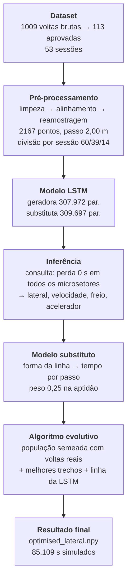

# Auditoria e validação do subsistema de ML

**Data:** 23/08/2026 · **Escopo:** `backend/ml/`

> Regra deste documento: nenhum número aqui vem de leitura de código. Cada um saiu
> de uma execução registrada em `data/ml/validation/evidencias.json`,
> `data/ml/pipeline_run.json` ou da saída do `unittest`. Onde algo **não** foi
> medido, está escrito que não foi.

Ambiente de todas as medições:

| | |
|---|---|
| Python | 3.9.7 |
| PyTorch | 2.8.0+cpu |
| Threads | 8 |
| Processador | AMD64 Family 25 Model 33 (AuthenticAMD) |
| Sistema | Windows 11 (10.0.26200) |
| GPU | nenhuma — CPU apenas |

### Reprodutibilidade — o que é e o que não é

As sementes são fixas (`config.SPLIT_SEED`, `TrainConfig.seed = 20260823`), mas
isso garante menos do que parece, e vale ser preciso sobre a diferença:

**Inferência e busca reproduzem exatamente.** Verificado num conjunto de pesos
anterior a este: duas validações consecutivas sobre os mesmos pesos devolveram
os mesmos valores até a última casa impressa, incluindo cada uma das 84 gerações
da busca e os dois controles. Sobre os pesos atuais a validação rodou uma vez —
o que reproduz é o procedimento, e a demonstração disso já foi feita.

**O treino reproduz sob número de threads fixo, e só.** Medido diretamente: duas
corridas de treino a 8 threads dão a mesma soma de pesos (−28,237592995747);
a 1 thread, também repetem entre si, mas num valor diferente
(−28,237587158037). A ordem em que as reduções de ponto flutuante são somadas
depende de como o trabalho foi particionado entre as threads, e soma de
`float32` não é associativa.

Isso não é teórico: um retreino desta auditoria, com a mesma semente e os mesmos
dados, divergiu da corrida original a partir de cerca da 18ª época e parou numa
época diferente (54 em vez de 40, melhor época 44 em vez de 38). As primeiras
épocas batiam até a 5ª casa decimal; a diferença nasceu abaixo da precisão
impressa e cresceu.

Duas consequências práticas, ambas já aplicadas:

1. Os números deste documento foram remedidos contra os pesos que estão no disco
   agora — não contra uma corrida anterior.
2. O embaralhamento do `DataLoader` passou a ter gerador próprio
   (`torch.Generator` sementeado com `config.seed`). Antes ele puxava do RNG
   global, que o *dropout* também consome a cada passagem, de modo que a ordem
   das amostras dependia de quantos números aleatórios o dropout tinha gasto
   antes — um acoplamento sem motivo entre duas coisas independentes.

Para reprodução bit a bit é preciso fixar também o número de threads
(`torch.set_num_threads`).

---

## 1. Fluxo real de execução



Executado de ponta a ponta em **168,8 s**:

```
cd backend && python -m ml.scripts.run_pipeline
```

| Etapa | Tempo | O que mediu |
|---|---:|---|
| dataset | 0,03 s | 1009 voltas brutas → 113 aprovadas, 53 sessões |
| pré-processamento | 0,08 s | 113 voltas na grade, 2167 pontos, passo 2,00 m |
| lstm | 1,22 s | carga dos dois modelos; volta ideal do piloto 84,052 s |
| inferência | 0,35 s | 84 a 271 km/h previstos; linha simulada em 88,880 s |
| substituto | 0,33 s | física 89,453 s vs rede 87,913 s |
| evolutivo | 166,40 s | 173 genes, 150 gerações, 12.081 avaliações, 87,950 → 85,953 s |
| resultado | 0,38 s | traçado gravado: 85,109 s simulados, 4270 m |

Comparação final do pipeline: melhor volta real **84,848 s medidos / 85,525 s
simulados**; traçado otimizado **85,109 s simulados** — **−0,416 s** sobre a
melhor volta real *quando as duas passam pelo mesmo simulador*. A comparação só
vale entre tempos simulados: o simulador quase-estático não reproduz o valor
absoluto medido (85,525 vs 84,848 na mesma volta, viés de +0,68 s).

O pipeline usa espaçamento de controle mais largo que a validação da seção 4
(173 genes contra 361), e por isso os dois números de busca não são
comparáveis entre si — cada um é interno à sua corrida.

O registro da corrida fica em `data/ml/pipeline_run.json`.

---

## 2. A LSTM está aprendendo?

```
cd backend && python -m ml.scripts.validate
```

| | Geradora | Substituta |
|---|---:|---:|
| Parâmetros | 307.972 | 309.697 |
| Janelas de treino | 8.160 | 7.620 |
| Janelas de validação | 5.304 | 4.953 |
| Épocas executadas | 60 (teto) | 26 |
| Melhor época | 60 | 16 |
| Perda de treino (1ª → última) | 0,09393 → 0,00186 | 0,10631 → 0,00614 |
| Redução | **−98,0 %** | **−94,2 %** |
| Melhor perda de validação | 0,01462 | 0,02769 |
| Perda de validação final | 0,01462 | 0,02787 |
| **Tempo de treinamento** | **980 s** | **392 s** |

Treino completo (as duas redes, incluindo montagem de atributos): **1389 s**, ou
23 minutos, em CPU.

As cinco perguntas, respondidas por medição:

**A perda cai?** Sim, quase duas ordens de grandeza nas duas redes, e a perda de
validação cai junto (0,04049 → 0,01462 na geradora), o que exclui a hipótese de
a queda ser só memorização.

Uma observação que a tabela entrega e vale registrar: **a geradora terminou na
época 60, que é o teto configurado, e a melhor época foi a última.** A parada
antecipada nunca disparou — o orçamento de épocas acabou antes de a validação
parar de melhorar. Ou seja, esta rede provavelmente está *subtreinada*, não
sobretreinada, e aumentar o teto é um experimento barato que ainda não foi
feito. A substituta é o caso oposto: parou sozinha na época 26, com a melhor na
16.

**Há diferença entre antes e depois do treino?** Sim. Comparação contra um gêmeo
não treinado (mesma arquitetura, mesmo escalonador, pesos aleatórios) e contra o
previsor da média — os dois testes rodam em `ml/validation/learning.py`. MAE no
conjunto de teste:

| Canal | Treinada | Não treinada | Previsor da média | Ganho sobre a média |
|---|---:|---:|---:|---:|
| lateral (m) | **1,533** | 3,565 | 3,613 | 58 % |
| velocidade (km/h) | **4,745** | 46,004 | 46,059 | 90 % |
| freio (0–1) | **0,065** | 0,480 | 0,154 | 58 % |
| acelerador (0–1) | **0,101** | 0,441 | 0,314 | 68 % |
| tempo por passo (s) | **0,0024** | 0,0105 | 0,0108 | 78 % |

A rede ganha dos dois em todos os canais. Contra o previsor da média — o teste
que importa, porque é ele que detecta uma rede que só aprendeu o valor médio —
a margem vai de 58 % a 90 %.

**Entradas diferentes produzem saídas diferentes?** Sim. Medido em
`responds_to_input`: diferença média de entrada 0,708 → diferença média de saída
15,70 (máxima 118,37).

**Está retornando valor constante?** Não. A razão entre o desvio-padrão da saída
e o do alvo fica perto de 1 em todos os canais (lateral 0,975; velocidade 0,964;
freio 1,083; acelerador 1,014; tempo por passo 0,968). O limiar de alarme é 0,01.

**Há overfitting?** Sim, e é o ponto mais frágil das duas redes. A razão entre a
melhor perda de validação e a perda final de treino é **7,9×** na geradora e
**4,5×** na substituta. Na substituta a parada antecipada conteve o dano
(guardou a época 16 de 26). Na geradora ela não chegou a agir, porque a
validação ainda estava caindo quando as épocas acabaram — a razão alta vem de a
perda de treino cair mais rápido, não de a validação piorar.

### Teste de sanidade: entrada A (rápida) contra entrada B (lenta)

"Entrada" significa coisas diferentes em cada rede, então o teste é feito nas
duas:

| | Entrada A | Entrada B | Saída A ≠ Saída B |
|---|---|---|---|
| **Geradora** (pedido de desempenho) | perda 0,0 s | perda 0,5 s/microsetor, 8 s/volta | ✅ 193,3 vs **137,7 km/h** de média; desvio lateral médio 3,04 m |
| **Substituta** (forma da linha) | volta `#0016`, 84,848 s medidos | volta `#0002`, 100,439 s medidos | ✅ 87,79 vs **89,06 s** previstos — ordem correta |

A geradora separa bem: pedir uma volta lenta derruba 56 km/h da média e move a
linha 3 m. A substituta acerta a **ordem** (a volta lenta é prevista como mais
lenta), mas comprime a diferença: 15,6 s de diferença medida viram 1,27 s
previstos. Ela é usada como termo de aptidão com peso 0,25, não como cronômetro,
mas essa compressão é uma limitação real e está listada nos próximos passos.

### Tempo de inferência

| Consulta | Tempo | Por amostra |
|---|---:|---:|
| Janela de 128 passos (lote de 32) | 16,0 ms | 0,50 ms |
| Volta inteira (2167 pontos) | 32,8 ms | 32,8 ms |

CPU, 8 threads, sem GPU.

---

## 3. Capacidade de generalização

Divisão **por sessão**, não por volta: voltas da mesma sessão são quase cópias
uma da outra (mesmo carro, mesmo pneu, mesmo piloto em minutos consecutivos), e
dividir por volta deixaria o modelo ver no treino praticamente a mesma volta que
seria cobrada no teste.

**Teste 1 — treino / validação / teste** (geradora):

| Canal | Treino | Validação | Teste | Degradação |
|---|---:|---:|---:|---:|
| lateral (MAE, m) | 0,147 | 0,526 | **1,533** | 10,4× |
| lateral (correlação) | 0,999 | 0,979 | **0,747** | |
| velocidade (MAE, km/h) | 0,543 | 1,774 | **4,745** | 8,7× |
| velocidade (correlação) | 1,000 | 0,998 | **0,988** | |
| freio (MAE, 0–1) | 0,007 | 0,020 | **0,065** | 9,1× |
| acelerador (MAE, 0–1) | 0,017 | 0,038 | **0,101** | 6,1× |

Substituta: tempo por passo 0,0007 → 0,0014 → **0,0024 s** (3,4×), correlação
0,950 → 0,938 → **0,925**.

RMSE no teste: lateral 3,383 m, velocidade 8,535 km/h, freio 0,198, acelerador
0,228, tempo por passo 0,0053 s. Erro lateral máximo: 30,92 m.

**A leitura honesta desses números.** O erro médio de 1,533 m esconde uma cauda,
e a cauda tem uma causa identificada: o erro por volta correlaciona **0,918** com
o tempo da volta.

| Volta | Tempo medido | MAE lateral |
|---|---:|---:|
| `#0016` | 84,848 s | 0,740 m |
| `#0004` | 85,543 s | 0,229 m |
| `#0002` | 86,148 s | 0,187 m |
| `#0003` | 89,287 s | 1,604 m |
| `#0004` | 91,888 s | 3,319 m |
| `#0003` | 94,276 s | 4,422 m |
| `#0002` | 100,439 s | **4,638 m** |

Média nas voltas abaixo de 88 s: **0,534 m**. Acima de 88 s: **2,865 m**. Ou
seja: a rede reproduz bem a trajetória de quem está andando rápido e erra feio
em quem está errando — o que é coerente com o que ela foi treinada para fazer
(gerar a linha *de referência*, condicionada a um pedido de desempenho), mas
significa que ela **não** serve para prever o que um piloto fora de ritmo vai
fazer.

Investiguei antes uma hipótese alternativa — que o erro viesse do arranque a
frio da LSTM dentro de cada janela. Ela não se sustentou: o erro na borda da
janela é 1,77 m contra 1,55 m no miolo, e aparar as bordas move a perícia de
0,108 para 0,113. A causa é a volta lenta, não a janela.

**Teste 2 — volta desconhecida**, a pior do conjunto de teste (`#0002`, 100,439 s,
136 janelas):

| Canal | MAE | RMSE | Máximo | Mediana | p95 | Correlação |
|---|---:|---:|---:|---:|---:|---:|
| lateral (m) | 4,638 | 7,034 | 28,392 | 2,247 | 15,860 | **+0,318** |
| velocidade (km/h) | 12,776 | 16,374 | 89,956 | 10,824 | 31,153 | **+0,954** |
| freio (0–1) | 0,130 | 0,277 | 0,997 | 0,004 | 0,775 | +0,644 |
| acelerador (0–1) | 0,236 | 0,346 | 0,999 | 0,155 | 0,794 | +0,603 |

Mesmo no pior caso a velocidade continua fortemente correlacionada (0,954): a
rede sabe *onde* se anda rápido e devagar na pista, e erra *quanto* a linha se
desloca quando o piloto está fora do ritmo.

Na substituta, a pior volta desconhecida (`#0002`) dá MAE de 0,0067 s por passo,
RMSE 0,0095 s, correlação **+0,879**.

---

## 4. O algoritmo evolutivo evoluiu, ou só sorteou?

Um algoritmo evolutivo quase sempre "melhora": ele guarda o melhor que já viu, e
o melhor de mais amostras é melhor por construção. Um gráfico de custo caindo,
sozinho, não distingue evolução de sorteio com memória. Por isso a validação roda
**dois controles com o mesmo orçamento de 7.920 avaliações**.

| Cenário | Custo | |
|---|---:|---|
| **A** — melhor da população inicial, sem otimização | 87,187 s | |
| **B** — depois de 98 gerações | **85,852 s** | **+1,335 s** |
| Controle: amostragem uniforme no corredor | 223,059 s | busca ganha +137,207 s |
| Controle: **perturbação cega das mesmas sementes** | 87,187 s | busca ganha **+1,335 s** |

Em tempo físico simulado (sem os termos de regularização da aptidão): **86,946 s
→ 85,202 s**.

| | |
|---|---|
| Gerações | 98 (parou por estagnação; o limite era 150) |
| Avaliações | 7.920 |
| Genes | 361 (espaçamento de 12 m entre pontos de controle) |
| Convergência | geração 73 |
| Tempo de parede | 106,2 s |

**Houve evolução real.** O controle decisivo é o segundo: mesma população
inicial, mesmas 7.920 avaliações, mesma mutação correlacionada, mas **sem
seleção, sem cruzamento e sem elitismo** — é o algoritmo evolutivo com a evolução
removida. Ele terminou em **87,187 s, exatamente o custo inicial: zero
melhoria**. Todo o ganho de 1,335 s veio dos operadores, não do orçamento de
amostragem.

Vale sublinhar o que "zero melhoria" quer dizer aqui: 7.920 trajetórias
perturbadas ao acaso a partir de boas sementes não produziram **uma única**
melhor que a semente de onde partiram. O espaço não perdoa perturbação sem
direção.

O primeiro controle (223,059 s) mede outra coisa: o quanto o espaço é difícil.
Sortear 361 deslocamentos independentes produz uma trajetória que serpenteia de
borda a borda. Perder disso não provaria nada sobre os operadores — por isso ele
não é o controle que responde à pergunta.


*(cópia da corrida; o original sai em `data/ml/validation/`, que não entra no
repositório.)*

O gráfico traz a linha tracejada do controle cego em 87,19 s. O melhor custo cai
abaixo dela já na primeira geração e nunca volta. O painel de baixo mostra a
diversidade da população encolhendo ao longo das gerações — a busca estava
efetivamente encerrada quando a parada por estagnação disparou, na geração 98,
25 gerações depois do último ganho real (geração 73).

---

## 5. Onde o modelo está rodando

- [ ] dentro da API/backend principal
- [ ] como serviço separado
- [x] **apenas como script offline**
- [x] **apenas em ambiente de desenvolvimento**

| | |
|---|---|
| Linguagem | Python 3.9.7 |
| Framework | PyTorch 2.8.0+cpu |
| Dependências | `torch`, `numpy`, `pandas`, `scipy`, `pyarrow`, `matplotlib` (`backend/ml/requirements.txt`) |
| Hardware | CPU comum; sem GPU, sem CUDA |
| CPU/GPU | **CPU**, 8 threads |
| Armazenamento | os artefatos e o *store* de voltas ocupam ~11 GB em `data/` |
| Treinamento | 980 s (geradora) + 392 s (substituta); 1389 s o ciclo completo |
| Inferência | 0,50 ms por janela de 128 passos; 32,8 ms por volta inteira |

**O software atual consegue chamar o modelo automaticamente?** **Não.** Não
existe nenhum caminho de código do aplicativo até o modelo. O acionamento é
sempre uma linha de comando digitada por uma pessoa.

---

## 6. Integração com o software

**Classificação: C) isolado offline.**

O que foi procurado no repositório, e o que foi encontrado:

| Procurado | Encontrado |
|---|---|
| Endpoints da API que exponham o ML | nenhum |
| Chamadas HTTP para o subsistema | nenhuma |
| Serviços de backend que o importem | nenhum — nada fora de `backend/ml/` faz `import ml`, exceto os arquivos de teste |
| Banco de dados / filas | nenhum; a troca é por arquivo em `data/ml/` |
| Comunicação frontend/backend sobre ML | nenhuma |
| Carregamento dos modelos na inicialização | não acontece |
| Empacotamento (`.spec` do PyInstaller) | não menciona `ml` |
| Execução automática (CI, hooks, agendador) | nenhuma |

A dependência é de mão única e por arquivo: `ml/` lê a telemetria que o runtime
grava e escreve artefatos em `data/ml/`. `ml/` não importa `core/`, e `core/`
não importa `ml/`.

### O que falta, exatamente

1. **Um roteador que exponha o serviço.** A fronteira já existe:
   `backend/ml/service.py` define `RacingLineService.analyse(samples)`, que
   recebe as amostras cruas no formato que o runtime já grava (`player.jsonl`,
   com os pedais aninhados em `carPhysics.controls`) e devolve
   `LapAnalysis.to_api()` — um dicionário serializável com delta total, 60
   microsetores e as curvas anotadas. Falta o endpoint que chama isso.
2. **Carga dos artefatos na inicialização do aplicativo.** `RacingLineService`
   carrega geometria, envelope e traçado uma vez e reaproveita; carregar por
   requisição custaria segundos. Precisa acontecer no *startup*, e
   `service.missing()` já informa quais artefatos faltam para o serviço se
   declarar pronto.
3. **Uma decisão sobre o que é distribuído.** Hoje `data/ml/` tem ~11 GB e não
   entra no executável. Para o aplicativo empacotado funcionar é preciso decidir
   o que embarca: os pesos e o `optimised_lateral.npy` são pequenos e a geometria
   da pista é obrigatória; o *store* de voltas não precisa ir junto.
4. **Um gatilho.** Alguma coisa precisa decidir *quando* analisar — ao fechar uma
   volta, a pedido do usuário, ou em lote ao fim da sessão. Isso não existe em
   nenhuma forma.

Nada disso exige mudar o subsistema: os itens 1, 2 e 4 são código do aplicativo,
e o 3 é uma decisão de empacotamento.

---

## 7. Teste ponta a ponta

Como **não** existe integração, o teste simula o caminho que ela usaria — e o faz
exercitando código real, não uma maquete. `backend/tests/test_ml_service.py`
fabrica telemetria no formato exato do `player.jsonl` e a empurra por todo o
percurso:

```
amostras cruas → flatten → clean_lap → align_lap → evaluate_lap
              → resample_lap → compare_lap(referência) → LapAnalysis.to_api()
```

Em dois níveis:

- **contrato** (roda em qualquer máquina): monta o serviço com uma referência
  sintética, sem depender de `data/ml/`. Verifica que uma volta limpa é aceita e
  comparada, que os 60 microsetores e as curvas saem preenchidos, que o payload
  é serializável em JSON, que uma volta sem pedais é **recusada com motivo** em
  vez de estourar, e que uma lista vazia também.
- **artefatos reais** (pulado com mensagem quando `data/ml/` está vazio): repete
  contra o traçado otimizado e o envelope de verdade, e confere que a soma dos
  deltas dos 60 microsetores fecha com o delta total da volta.

O que falta para isso deixar de ser simulação é apenas o item 1 da seção
anterior: trocar a chamada direta a `RacingLineService` por uma requisição a um
endpoint que faça a mesma chamada.

---

## 8. Relatório final

### 8.1 Status atual do projeto

O subsistema de ML está **funcional e validado como pipeline offline, e não está
integrado ao aplicativo**. As duas redes aprendem, generalizam dentro de um
regime que dá para descrever com precisão, e o algoritmo evolutivo produz ganho
real e demonstrável contra um controle apropriado. Nada disso é alcançável pelo
software principal hoje.

### 8.2 Componentes funcionando

Todos verificados por execução:

| Componente | Evidência |
|---|---|
| Leitura e triagem do dataset | 1009 voltas brutas → 113 aprovadas, 53 sessões |
| Pré-processamento e alinhamento | 113 voltas em grade de 2167 pontos, passo 2,00 m |
| Divisão sem vazamento | por sessão: 60 treino / 39 validação / 14 teste |
| LSTM geradora | perda −98,0 % em 980 s; ganha do gêmeo não treinado e da média em 4/4 canais |
| LSTM substituta | perda −94,2 % em 392 s; ganha da média por 78 % |
| Inferência | 0,50 ms/janela; 32,8 ms/volta |
| Simulador quase-estático | reproduz a melhor volta real em 85,525 s (medida: 84,848 s) |
| Algoritmo evolutivo | +1,335 s sobre a população inicial; +1,335 s sobre o controle cego |
| Função de aptidão | usada em 7.920 avaliações por corrida, com o termo da substituta |
| Visualização | `fitness_por_geracao.png` gerado com a linha de controle |
| Pipeline completo | 168,8 s de ponta a ponta |

### 8.3 Componentes não integrados

**Todos.** Nenhuma parte de `backend/ml/` é alcançada pelo aplicativo. Falta
endpoint, carga na inicialização, decisão de empacotamento e gatilho — detalhado
na seção 6.

`backend/ml/service.py` e `backend/tests/test_ml_service.py` foram escritos nesta
auditoria justamente para que a integração deixe de ser hipótese: passou a
existir uma fronteira concreta e um teste que a exercita inteira.

### 8.4 Evidências de funcionamento

Arquivos gerados por execução, todos em disco:

| Arquivo | Conteúdo |
|---|---|
| `data/ml/validation/evidencias.json` | todas as métricas desta auditoria, incluindo o histórico por geração |
| `data/ml/validation/fitness_por_geracao.png` | custo e diversidade por geração, com o controle |
| `data/ml/pipeline_run.json` | tempo e medidas das 7 etapas |
| `data/ml/models/reference/`, `.../surrogate/` | pesos, arquitetura, escalonadores e histórico de treino |
| `data/ml/optimization/optimised_lateral.npy` | o traçado resultante |

### 8.5 Testes executados

| Suíte | Cobre |
|---|---|
| `test_ml_models.py` (21 testes) | contagem de parâmetros, largura da cabeça bidirecional, limitação por sigmoide dos canais 0–1, invariância ao tamanho do lote; a perda cai, a validação cai, a melhor época é guardada, ganha do não treinado e da média, a saída não é constante, entradas diferentes dão saídas diferentes, salvar/carregar preserva a previsão, o escalonador é ajustado só no treino; transformação de alvos; janelamento com e sem aquecimento circular |
| `test_ml_service.py` (6 testes) | o caminho ponta a ponta descrito na seção 7 |
| Restante da suíte do backend | pré-processamento, geometria, microsetores, comparação |

Os testes de treino usam um sinal sintético cujo alvo é função **conhecida** da
entrada — se a rede não aprender essa função, o teste falha; ele não se contenta
com "a perda diminuiu".

### 8.6 Resultados obtidos

- A LSTM aprende: perda de treino cai 98,0 % e 94,2 %, com a validação
  acompanhando.
- A LSTM não decorou a média: ganha do previsor da média em todos os canais, de
  58 % (lateral) a 90 % (velocidade).
- A LSTM responde à entrada: pedir volta lenta em vez de rápida muda a saída em
  56 km/h de média e 3,04 m de linha.
- A generalização é boa no regime rápido e ruim no lento: 0,534 m de erro lateral
  em voltas abaixo de 88 s contra 2,865 m acima disso, com correlação de 0,918
  entre tempo de volta e erro.
- O algoritmo evolutivo evolui de verdade: **+1,335 s contra um controle de mesmo
  orçamento que, em 7.920 tentativas, não melhorou nada.**
- O traçado otimizado simula em 85,109 s contra 85,525 s da melhor volta real no
  mesmo simulador (**−0,416 s**).
- A geradora está subtreinada, não sobretreinada: bateu no teto de 60 épocas com
  a melhor época sendo a última.
- O ML está isolado: **C) isolado offline.**

### 8.7 Próximos passos necessários

**Para integrar** (nenhum exige mexer no subsistema):

1. Expor `RacingLineService.analyse()` num endpoint e carregar o serviço na
   inicialização do aplicativo.
2. Definir o que vai no executável: pesos + geometria + traçado, sem o *store* de
   voltas.
3. Definir o gatilho: ao fechar volta, sob demanda, ou em lote no fim da sessão.

**Para melhorar o modelo:**

4. **Aumentar o teto de épocas da geradora.** Ela terminou na época 60 de 60 com
   a melhor validação na última — a parada antecipada nunca agiu. É o
   experimento mais barato da lista e o único cujo resultado é previsível: há
   ganho ainda na mesa.
5. Atacar a cauda do erro. As voltas lentas dominam o erro de teste e a rede não
   foi feita para prevê-las. Duas saídas possíveis: restringir o treino ao regime
   rápido e assumir isso explicitamente, ou condicionar melhor a rede ao nível de
   desempenho pedido. A escolha muda o que o sistema promete.
6. Corrigir a compressão da substituta: 15,6 s de diferença medida viram 1,27 s
   previstos. Enquanto ela for só um termo de peso 0,25 na aptidão isso é
   tolerável; se virar estimador de tempo, não é.
7. Rodar o experimento controlado de `surrogate_weight ∈ {0; 0,25; 0,5}` com
   várias sementes, para medir se o termo da substituta ajuda a busca ou só a
   perturba. Hoje o peso 0,25 é uma escolha, não um resultado.

**Sobre o conjunto de dados:**

8. 113 voltas aprovadas de 1009 brutas é uma taxa de aproveitamento de 11 %. Vale
   medir *por que* as outras 896 foram recusadas — se for excesso de rigor na
   triagem, há dados sobrando na mesa.

**Já resolvido nesta auditoria:**

- `docs/lstm_matematica.md` §11 afirmava que a perícia de 0,11 significava que
  "a rede mal supera prever a média". Era falso — a rede ganha da média por 58 %
  no MAE, e a perícia é baixa por causa da cauda das voltas lentas. A seção foi
  corrigida e aponta para a §3 deste documento.
- O tempo de treino não era registrado em lugar nenhum; agora fica no artefato
  do modelo.
- O embaralhamento do `DataLoader` puxava do RNG global, compartilhado com o
  *dropout*; ganhou gerador próprio, com teste de regressão.
